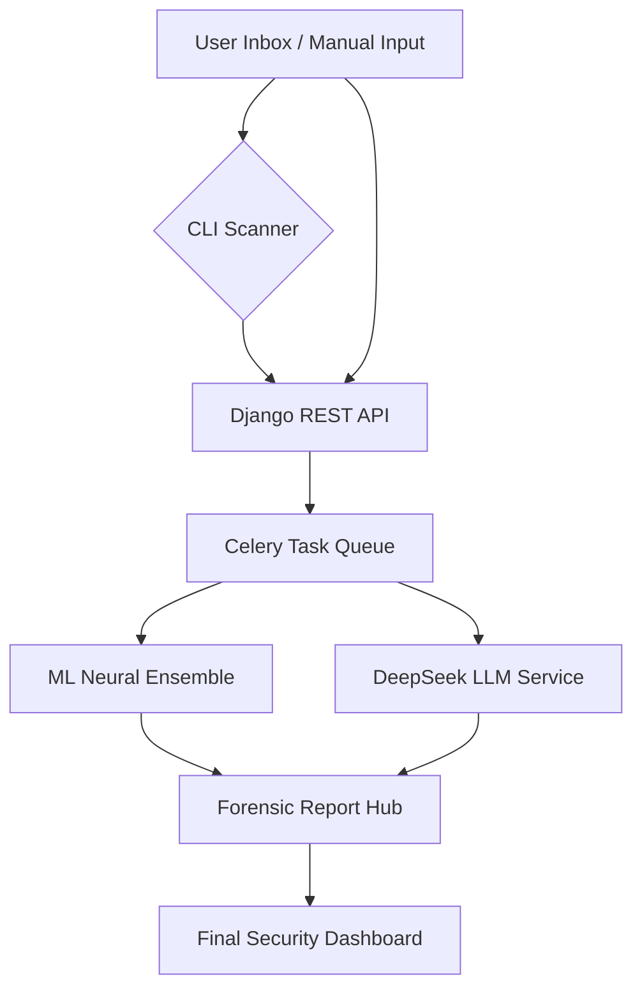

# 🛡️ Deep Learning-Based Phishing Detection & Intelligence System

[](https://www.python.org/downloads/)
[](https://www.djangoproject.com/)
[]()
[]()

A state-of-the-art cybersecurity platform that integrates **Hybrid Deep Learning architectures** with **Large Language Model (LLM)** forensics to detect, analyze, and neutralize phishing threats across Email, SMS, and URL vectors.

---

## 🚀 Beginner's Quick Start

**If you are new to this project, follow these 4 steps to get up and running immediately.**

### 1. Clone the Laboratory
Copy the project files to your local machine:
```bash
git clone https://github.com/kim-kimani/Deep-Learning-Based-Phishing-Detection-System
cd Deep-Learning-Based-Phishing-Detection-System
```

### 2. Create a Private Environment (Virtual Env)
Isolate the project dependencies to avoid conflicts with your system:
```bash
# Create the environment
python3 -m venv venv

# Activate it
source venv/bin/activate  # On Linux/macOS
# OR
venv\Scripts\activate     # On Windows
```

### 3. Install the Essentials
Install the required tools and libraries:
```bash
pip install -r requirements.txt
```

### 4. Run your first Security Scan
The easiest way to see the system in action is the automated scanner:
```bash
# Give permission (Linux/Mac only)
chmod +x scanner/emailscan

# Run the scan
./scanner/emailscan
```
*Note: This will start the server and run a self-test automatically!*

---

## 🔬 Research & Methodology

This project is built on the intersection of **Linguistic Forensics** and **Graph Topology**. Our methodology focuses on identifying "Intent-based Anomalies" rather than just keyword matching.

### 📚 Datasets Used
- **Email Phishing Collection**: Over 100k curated emails including "Mailing List" and "Personal Inbox" simulations.
- **Malicious URL Dataset**: 650k+ URLs categorized into *Benign, Defacement, Phishing, and Malware*.
- **SMS Spam Dataset**: UCI SMS Spam Collection with custom-augmented social engineering samples.

### 🤖 Multi-Tiered Model Architecture
Our "Ensemble of Experts" approach utilizes different neural architectures for different threat vectors:

1.  **CNN-LSTM Hybrid (Email Content)**: Uses **Convolutional layers** for local spatial features (malicious keyword clustering) followed by **LSTM (Long Short-Term Memory)** to understand long-range temporal dependencies in phishing narratives.
2.  **Graph Neural Networks (URL Topology)**: Analyzes the relationship between subdomains, TLDs, and redirection chains by representing the URL structure as a graph node.
3.  **Attention-Based Transformers**: Leverages self-attention mechanisms to identify subtle psychological triggers like "Urgency," "Authority," and "Fear" within unstructured text.
4.  **Ensemble Forest (Meta-Classifier)**: A final decision layer that aggregates scores from all neural experts to provide a consolidated risk level.

---

## 🛠️ Advanced Installation

### Tiered Dependency Management
The project uses a modular installation system to optimize for different environments.

| Tier | Target Environment | Installation Command |
| :--- | :--- | :--- |
| **Basic** | Local Testing / UI Development | `pip install -r requirements/essential_requirements.txt` |
| **Deep Learning** | Model Training & Fine-Tuning | `pip install -r requirements/deep_learning_requirements.txt` |
| **AI Enhanced** | Production with DeepSeek Analysis | `pip install -r requirements/enhanced_requirements_fixed.txt` |
| **Full Suite** | Complete Multimodal Hub | `pip install -r requirements.txt` |

### External Requirements
- **Redis Server**: Essential for Celery task orchestration (`sudo apt install redis-server`).
- **Tesseract & Librosa**: Required for Image OCR and Audio Analysis (Multimodal features).

---

## 🔍 CLI Mastery: The `./scanner/emailscan` Tool

The platform features a "Headless Audit" tool designed for cybersecurity professionals who need to run secure scans without leaving the terminal.

### Usage Options
```bash
# 1. Automate Everything (Auto-start API + Fetch + Scan)
./scanner/emailscan

# 2. Fetch specific number of emails
./scanner/emailscan --fetch 5

# 3. Manual Forensic Analysis
./scanner/emailscan --subject "Urgent: Refund" --body "Please click here..."

# 4. Batch Scan from File
./scanner/emailscan --file evidence.txt
```

### Forensic Output
Every scan generates twin reports in `scanner/Scan Results Dir/`:
- **📂 ML Scan**: Technical JSON/Text breakdown of model scores.
- **📂 AI Scan**: Professional HTML forensic report with DeepSeek's detailed reasoning, linguistic analysis, and risk scoring.

---

## ⚡ System Architecture



---

## 🚀 Roadmap: The Future of Phishing Detection

- [ ] **Phase 1: Zero-Trust Integration**: Implementing OAuth 2.0 for all scanner operations and encrypted local storage for forensic data.
- [ ] **Phase 2: Real-time API Hooks**: Webhooks for real-time notification to enterprise SIEM platforms (Splunk, ELK).
- [ ] **Phase 3: Blockchain Validation**: Storing "Known Bad" domain hash signatures on a decentralized ledger for immutable blacklisting.
- [ ] **Phase 4: Agentic Defense**: Autonomous AI agents that can proactively draft "safe-reply" templates for social engineering neutralization.

---

## 🔑 Environment Secrets
The system requires a `.env` file for core operations. See `ENV_CONFIGURATION_GUIDE.md` for a master guide.

```bash
# Required for AI Forensics
DEEPSEEK_API_KEY=your_key_here

# Required for Scanner
GMAIL_EMAIL=user@gmail.com
GMAIL_PASSWORD=your_app_password
```

---

## 🔬 Contributing & Support
This is an open platform for cybersecurity advancement.
- **Security Issues**: Please report via GitHub issues.
- **Testing**: Run `pytest` or `python manage.py test`.
- **Logs**: Monitor `logs/django.log` and `scanner/scanner.log`.

---
*Designed with ❤️ by the Cybersecurity Research Team.*